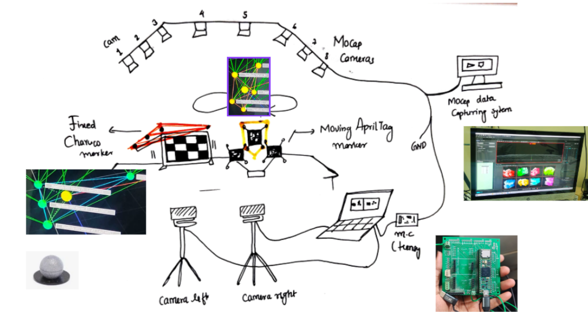
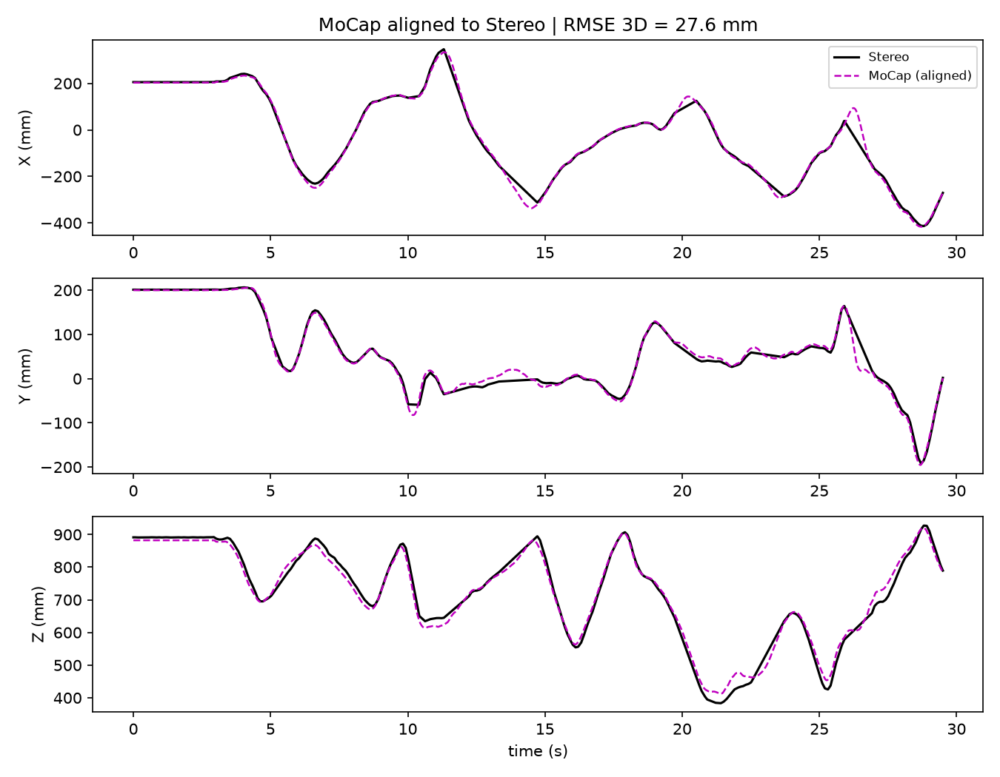
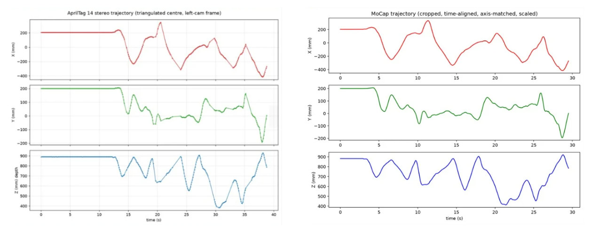
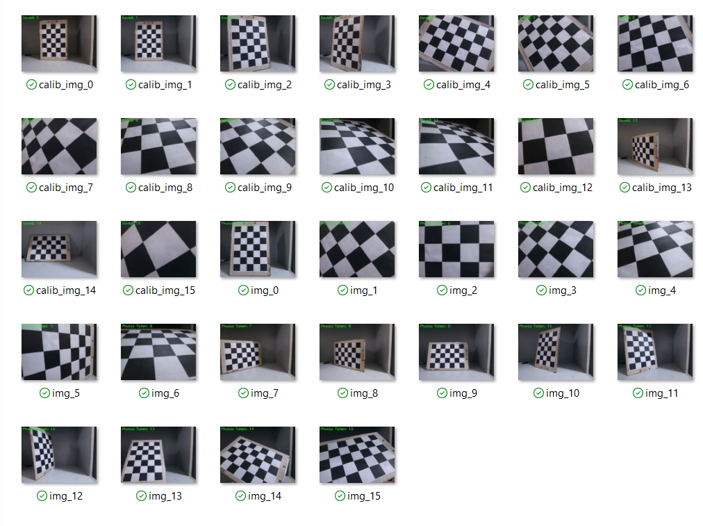
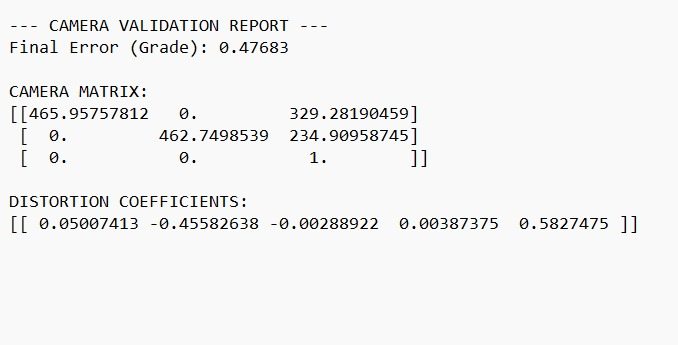
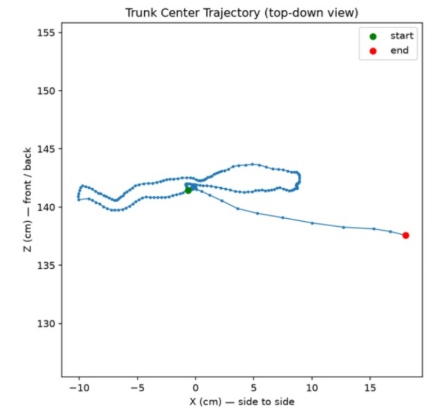
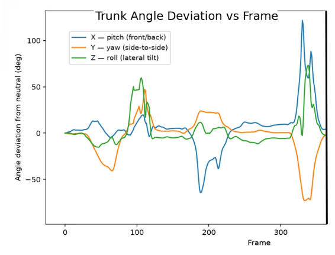
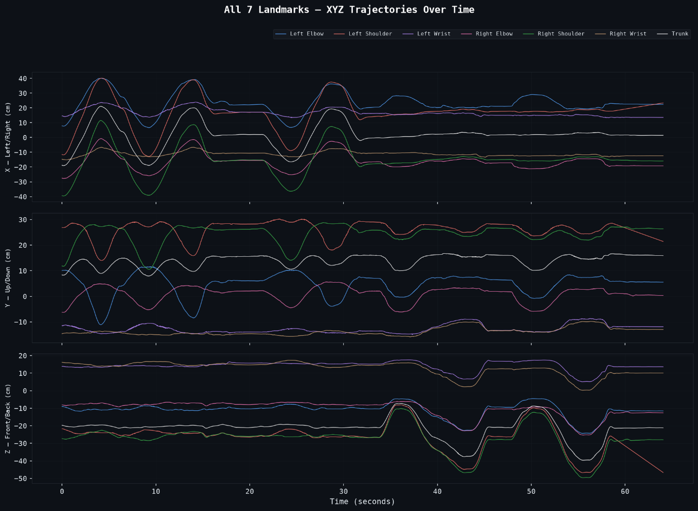
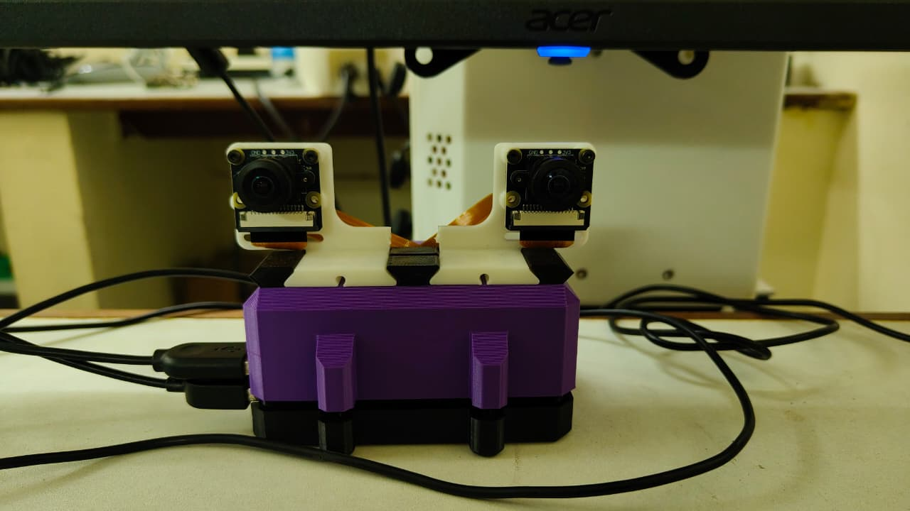

# Multi-Camera System for General-Purpose Assessment and Training of Movement Functions

**Problem** → Clinical motion capture is accurate but costly and lab-bound — a real barrier for routine rehab movement assessment.
**Solution** → Dual consumer-webcam stereo pipeline: calibration → 3D reconstruction → MediaPipe pose tracking → joint-angle estimation.
**Validation** → Synchronized against an OptiTrack motion-capture system as ground truth.
**Result** → **27.6 mm 3D RMSE**, calibration reprojection error reduced from >1.0 px to **0.47–0.77 px**.

Developed at the Department of Bioengineering, Christian Medical College (CMC), Vellore, under Dr. Sivakumar Balasubramanian.

## Experimental Setup



Two stereo webcams, a fixed ChArUco reference board, a moving AprilTag marker mount, and an 8-camera OptiTrack MoCap ring — synchronized via Arduino/Teensy timing signal.

## Key Result





## Method

**1 — Calibration**: 13×9 checkerboard, `cv2.calibrateCamera()` (Zhang's method) → **0.47–0.77 px** reprojection error, extrinsics via `cv2.stereoCalibrate()`.




**2 — 3D Reconstruction**: `cv2.solvePnP()` (ITERATIVE) tracks a 3-tag AprilTag mount (ID 12/14/20 fallback logic) against a static ChArUco reference frame. Camera/MoCap frames synced via Arduino signal, ±5 ms nearest-neighbour match.

**3 — Trunk Tracking**: MediaPipe Pose → 7 landmarks (shoulders, elbows, wrists, trunk centre) → `cv2.triangulatePoints()` → pitch/yaw/roll decomposition.





**4 — Raspberry Pi Portable System**: dual-camera 3D-printed rig, calibrated once, reused indefinitely.



## Tech Stack

Python · OpenCV · MediaPipe · NumPy · Raspberry Pi (Picamera2) · Arduino/Teensy · AprilTag · ChArUco · OptiTrack (ground truth)

## Repository Structure

```
multi-camera-movement-assessment/
├── calibration/       # Intrinsic + stereo calibration
├── tracking/           # Raw capture + ChArUco/MediaPipe world-frame tracking
├── validation/          # MoCap comparison, error analysis, speed-vs-error
├── raspberry_pi/          # Picamera2-based portable capture pipeline
├── archive/                 # Earlier experiment iterations
├── images/                    # Figures used in this README
└── README.md
```

## Data & Privacy

Processing pipeline and result figures only — no raw MoCap exports, participant video, or subject-identifying data, per CMC Vellore data-sharing constraints.

## Status

Objectives 1–3 validated with quantitative results above. Objective 4 (Raspberry Pi real-time deployment) is ongoing.

## Acknowledgements

Department of Bioengineering, CMC Vellore, supervised by Dr. Sivakumar Balasubramanian. M.Tech Clinical Engineering, IIT Madras.

## License

MIT
